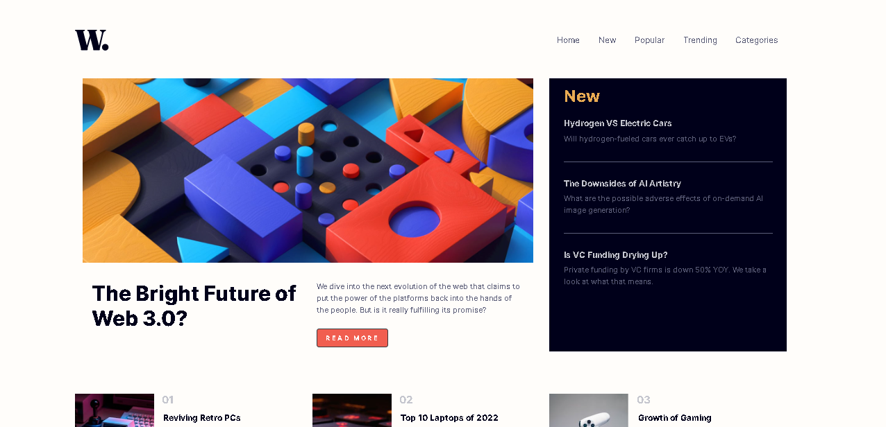
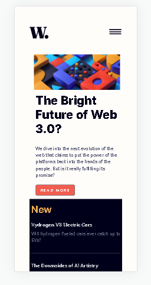

# Frontend Mentor - News homepage solution

This is a solution to the [News homepage challenge on Frontend Mentor](https://www.frontendmentor.io/challenges/news-homepage-H6SWTa1MFl). Frontend Mentor challenges help you improve your coding skills by building realistic projects. 

## Table of contents

- [Overview](#overview)
  - [The challenge](#the-challenge)
  - [Screenshot](#screenshot)
  - [Links](#links)
- [My process](#my-process)
  - [Built with](#built-with)
  - [What I learned](#what-i-learned)
  - [Continued development](#continued-development)
  - [Useful resources](#useful-resources)
- [Author](#author)

## Overview

### The challenge

Users should be able to:

- View the optimal layout for the interface depending on their device's screen size
- See hover and focus states for all interactive elements on the page
- **Bonus**: Toggle the mobile menu (requires some JavaScript)

### Screenshot

### Links

- Solution URL: [Solution Repo](https://www.github.com/michizler/news-homepage-main)
- Live Site URL: [Live page](https://michizler.github.io/news-homepage-main/)

## My process

### Built with

- Semantic HTML5 markup
- CSS custom properties
- Desktop-first workflow
- [Bootstrap 4](https://getbootstrap.com/) - Bootstrap library

### What I learned

Well I reinforced my knowledge of the Bootstrap container properties and it really helped in implementing the grid layout of the website beautifully. I also understood the importance of making your codes (especially stylesheets) modular. It saved me much time when implementing active states on the webpage.

### Continued development

The Boostrap components really made the comletion of this project easier. I want to continue gaining mastery of the different ones used and not used in this project to decrease my build time. Also, I want to test the nesting of different components together as well to see their effectiveness in synergy.

### Useful resources

- [Bootstrap nav bar](https://stackoverflow.com/questions/43930068/bootstrap-4-mobile-nav-bar-slide-from-left) - This helped me for the nav bar implementation. I really liked this pattern and will use it going forward.
- [CSS float](https://www.w3schools.com/css/css_float.asp) - This is an amazing article which helped me finally understand the float property of CSS. I'd recommend it to anyone still learning this concept.

## Author

- Website - [Bright Uzosike](https://www.linkedin.com/in/bright-uzosike-a413711b2/)
- Frontend Mentor - [@michizler](https://www.frontendmentor.io/profile/michizler)
- Twitter - [@thundrizzy](https://www.twitter.com/thundrizzy)
- Github - [@michizler](https://www.github.com/michizler)
